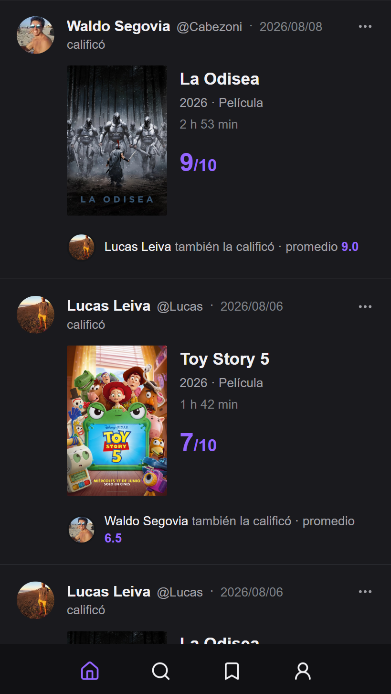
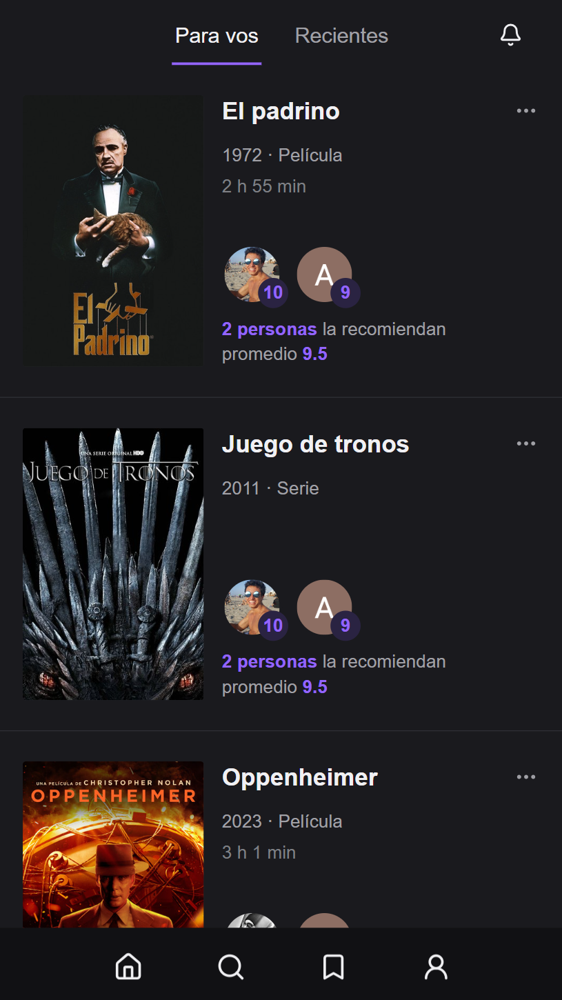
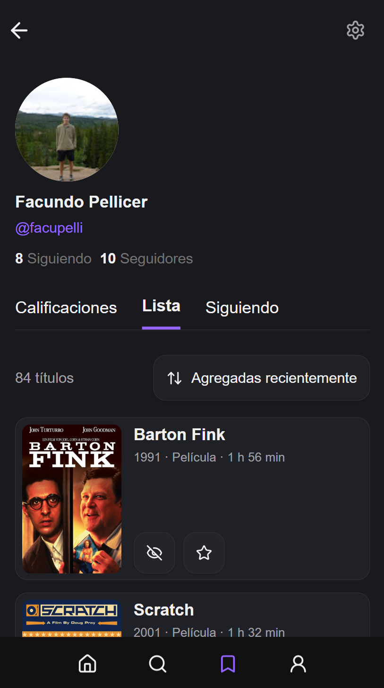

# Que Ves

Social movie discovery and recommendations PWA.

Que Ves is a mobile-first app for rating movies and series, following friends, discovering what people around you are watching, and keeping track of what you want to watch next.

## Product

Users can rate movies and series, see activity from people they follow, discover recommendations based on their social circle, and maintain their own watchlist.

  
  &nbsp;&nbsp;
  
  &nbsp;&nbsp;
  

## Core capabilities

- Rate movies and series
- Follow other users
- Social activity feed
- Recommendations based on people you follow
- Personal watchlist
- User profiles and activity
- Search and movie discovery
- Installable mobile-first PWA

## Engineering highlights

### Social recommendation model

Recommendations are driven by the activity of people a user follows rather than by a generic global popularity list.

This makes discovery contextual: users can see who recommended a title, their ratings, and the average opinion within their social circle.

### Activity feed

Ratings are represented as social activity, allowing users to discover movies and series naturally through people they know rather than through a traditional catalog-only interface.

### Mobile-first PWA

Que Ves is designed primarily around mobile interaction and can be installed as a Progressive Web App, providing an app-like experience without requiring a native client.

## Tech stack

### Frontend

- Next.js
- React
- Tailwind CSS

### Data

- PostgreSQL
- Drizzle ORM
- Redis
